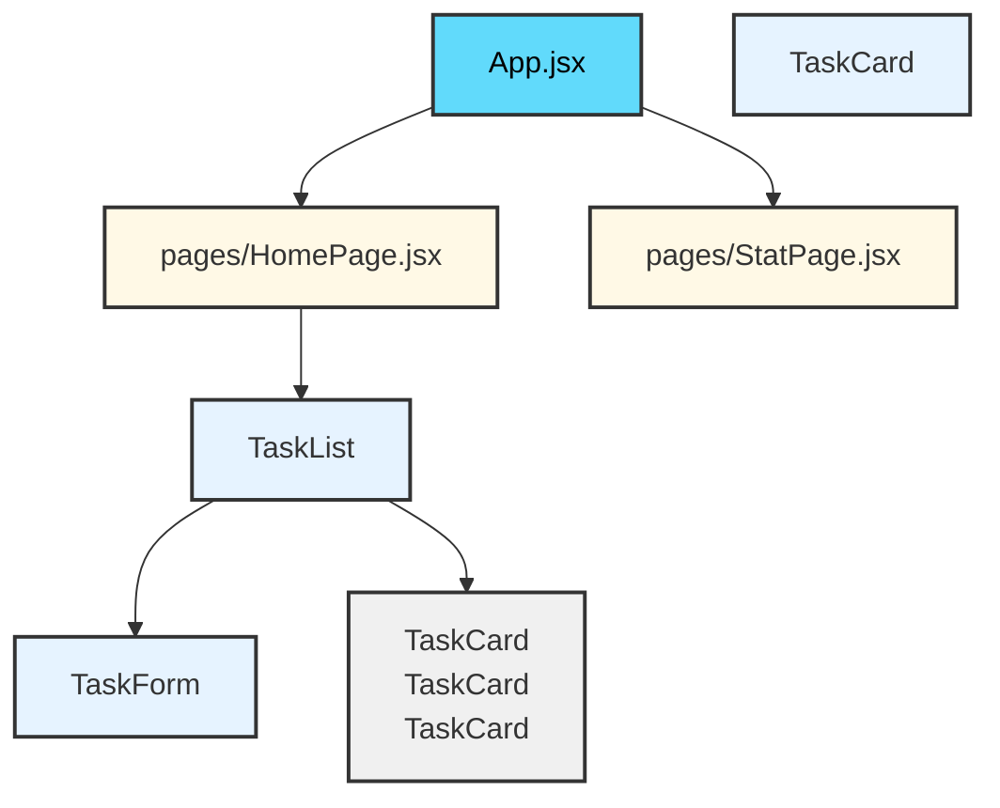

# React Project Structure

A well-organized project structure makes your codebase more maintainable, scalable, and easier for teams to navigate. By breaking down your application into smaller, focused components, you gain several key benefits:

**Why Component-Based Structure?**
- **Reusability**: Components can be used across multiple pages without duplicating code
- **Maintainability**: Smaller, focused components are easier to understand, test, and update
- **Scalability**: As your project grows, a clear structure prevents the codebase from becoming chaotic
- **Collaboration**: Team members can work on different components independently without conflicts

## Structure

```
src/
├── components/
│   ├── TaskCard/
│   │   ├── TaskCard.jsx
│   │   └── TaskCard.css
│   ├── TaskForm/
│   │   ├── TaskForm.jsx
│   │   └── TaskForm.css
│   └── TaskList/
│       ├── TaskList.jsx
│       └── TaskList.css
├── pages/
│   ├── HomePage.jsx
│   └── StatPage.jsx
├── App.css
├── App.jsx
├── main.jsx
└── index.css
```

## Component Hierarchy Diagram



## Key Principles

- **One Component Per File**: Each component gets its own JSX file with corresponding styles
- **Co-locate Styles**: Keep CSS files next to their components for easier management
- **Pages vs Components**: Use `pages/` for full route views, `components/` for reusable UI elements
- **Global Styles**: Store shared styles in the `styles/` directory
